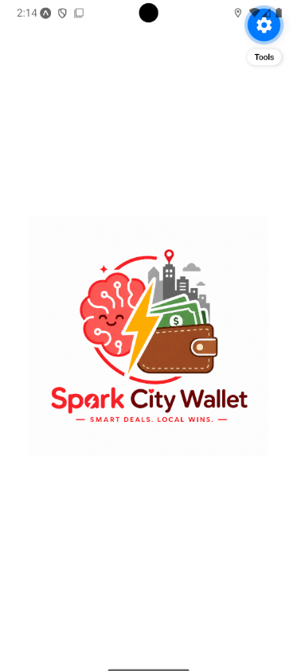
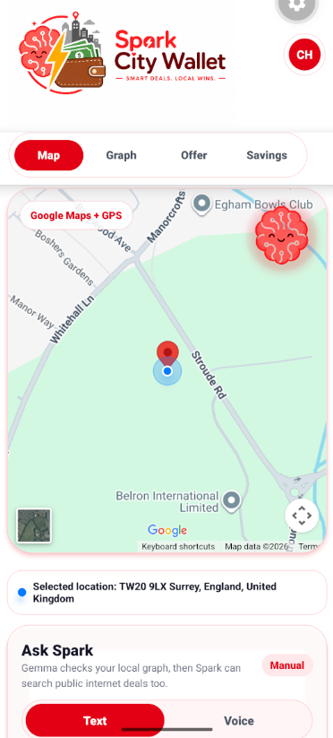
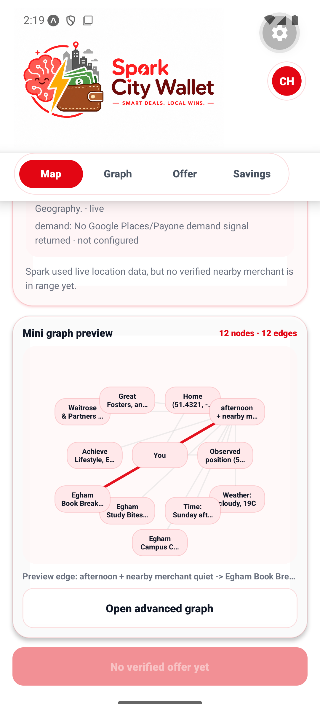

# Spark City Wallet

Spark City Wallet is a React Native and Expo mobile app for a real-time, AI-assisted city wallet. It is designed around a simple idea: offers should be generated at the moment they are useful, using live local context, merchant rules, and privacy-preserving user intent.

The app combines a customer wallet, a merchant control centre, Google Maps, local graph memory, Gemini-powered public web discovery, local Gemma inference, QR redemption, and aggregate merchant analytics.

## Product Overview

Spark is not a static coupon list. The customer app senses context, infers a private intent, asks an AI agent for grounded deal intelligence, and generates a time-limited wallet offer. The merchant app defines business goals and guardrails, then reviews campaign performance and local signals.

Core capabilities:

- Live context sensing from location, time, weather, Google Places metadata, local events, merchant opening status, and transaction-density adapters.
- Google Maps customer experience with current-location display, map-driven context refresh, and Spark's floating assistant.
- Private on-device knowledge graph for preferences, routines, places, prompts, and offer outcomes.
- Advanced graph canvas with clusters, pan, zoom, fullscreen, draggable nodes, node inspection, and a compact map-page preview.
- Local Gemma path for private intent handling where raw user graph data stays on device.
- Hermes/Gemini path for public deal discovery using only abstract intent and non-personal context.
- Generative offer engine that creates copy, discount, timing, channel, visual tone, expiry, and redemption metadata from current context and merchant rules.
- QR/token redemption with backend proof validation, replay protection, cashback ledger updates, and aggregate merchant analytics.
- Business mode with a merchant dashboard, Caffè Nero example account, radius map, Google Places signals, event scanning, Spark recommendations, and campaign controls.
- Persistent accounts, sessions, wallet ledger, settings, theme selection, and local graph controls.

## App Screenshots

<p>
  
  
  
  
</p>

## Architecture

```text
React Native / Expo app
  -> Context engine
     -> Google Maps / device location
     -> Weather adapter
     -> Google Places adapter
     -> Event adapter
     -> Transaction-density adapter
  -> Local knowledge graph
     -> Local Gemma runtime through Ollama
  -> Hermes agent gateway
     -> Gemini models for public web intelligence
  -> City Wallet API
     -> Accounts, merchants, rules, offers, redemptions, ledger, analytics
```

The app keeps raw habits, preference history, movement context, and graph memory local. Cloud AI calls receive abstract intent, city-level context, merchant category, public context signals, and optional public-site navigation skills.

## Runtime Requirements

Create a `.env` file with the required runtime values:

```bash
EXPO_PUBLIC_CITY_WALLET_API_URL=http://10.0.2.2:3001
EXPO_PUBLIC_HERMES_AGENT_URL=http://10.0.2.2:3001
EXPO_PUBLIC_GEMINI_API_KEY=your-gemini-api-key
EXPO_PUBLIC_LOCAL_GEMMA_URL=http://10.0.2.2:11434
EXPO_PUBLIC_LOCAL_GEMMA_MODEL=gemma4:e4b
EXPO_PUBLIC_CITY_WALLET_USER_ID=city-wallet-user
EXPO_PUBLIC_CITY_WALLET_SCENARIO=egham
EXPO_PUBLIC_GOOGLE_MAPS_API_KEY=your-google-maps-key
EXPO_PUBLIC_GOOGLE_ANDROID_CLIENT_ID=your-google-android-oauth-client-id
EXPO_PUBLIC_GOOGLE_WEB_CLIENT_ID=your-google-web-oauth-client-id
```

Use `127.0.0.1` instead of `10.0.2.2` when running outside the Android emulator.

`EXPO_PUBLIC_CITY_WALLET_SCENARIO` accepts `egham`, `stuttgart`, or `gps`. The scenario controls the starting city configuration only; live adapters still determine the available context.

## API Surface

The local development API in `server/dev-api.js` exposes the same shape expected by the app:

- `POST /accounts`
- `POST /sessions`
- `GET /users/:userId`
- `GET /users/:userId/ledger`
- `POST /integrations/google-calendar/sync`
- `GET /merchants/nearby?lat=&lon=`
- `POST /merchants/:merchantId/rules`
- `GET /merchants/:merchantId/event-intelligence`
- `POST /merchants/:merchantId/event-intelligence`
- `POST /merchants/:merchantId/event-intelligence/scan`
- `GET /events/nearby?lat=&lon=`
- `GET /payone/transaction-density?merchantIds=`
- `POST /offers/generate`
- `POST /redemptions/issue`
- `POST /redemptions/:tokenId/validate`
- `GET /merchants/:merchantId/analytics`
- `GET /connectors/health`
- `POST /hermes/tasks`

Local Gemma is expected through Ollama at:

- `POST /api/chat`

## AI Models

The app currently exposes four browser-agent choices:

- Gemini 3.1 Pro Preview
- Gemini 3.0 Flash Preview
- Gemini 3.1 Flash Lite Preview
- Gemma private local mode

The Gemini path is routed through the Hermes endpoint. Gemma private mode calls the local Ollama runtime directly.

## Run Locally

Install dependencies:

```bash
npm install
```

Start the local API:

```bash
npm run api
```

Start the app:

```bash
npm run android
```

For the configured Android emulator workflow on Windows:

```bash
npm run emulator
npm run android:phone
```

Web and iOS entry points are also available:

```bash
npm run web
npm run ios
```

## Validation

Run TypeScript validation:

```bash
npm run typecheck
```

Run the full smoke suite:

```bash
npm run smoke:full
```

Run city/source scenario checks:

```bash
npm run smoke:scenarios
```

The smoke suite validates API contracts, account/session handling, connector health, live-context coordinate validation, merchant rule guardrails, event intelligence guardrails, generated-offer expiry, QR proof validation, replay rejection, decline analytics, ledger updates, and aggregate merchant analytics.

## Customer Flow

1. Sign in or create an account.
2. Open the map to view the current location and nearby context.
3. Let Spark infer a private local intent from context and graph memory.
4. Search manually or respond to a Spark routine prompt.
5. Review the generated offer card.
6. Accept before expiry to issue a QR redemption token.
7. Validate the token through merchant checkout.
8. Review cashback and offer history in the wallet.
9. Inspect local graph memory in the graph view.

## Merchant Flow

1. Switch to business mode from the profile menu.
2. Review the merchant dashboard and local reach map.
3. Adjust the campaign radius and offer guardrails.
4. Refresh event intelligence for upcoming local demand signals.
5. Ask Spark for a spoken recommendation.
6. Apply recommended campaign settings when appropriate.
7. Review active campaigns and aggregate performance metrics.

## Privacy

Spark City Wallet is designed around data minimisation:

- Raw graph memory stays on the device.
- Local Gemma handles private intent and graph traversal.
- Gemini receives only abstract intent and non-personal context.
- Merchant analytics are aggregate.
- QR payloads avoid embedding raw user identity.
- Graph controls allow local inspection and pausing of graph use.

## Why It Matters

Local merchants compete with platforms that already use dynamic demand signals, algorithmic timing, and personalised interfaces. Spark City Wallet brings that responsiveness into a privacy-conscious city wallet: merchants set goals and limits, the wallet senses the live moment, and AI creates a relevant offer only when it is useful.
